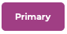
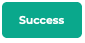
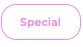

Dito-CSS Is a simple minified css file that allows you to focus more on content or layout.
you can either download the css file and keep what you want or use the css min version and use the classes provided.

*Dito-CSS Is not made to make responsive design easier but to make layout and design a little easier*

## Buttons               
| class         | description       |
| ------------- | ----------------- |
| btn           | regular           |
| btn-md        | medium            |
| btn-lg        | large             |
| btn-r-hw      | round hover white |
| btn-r-hb      | round hover black |

 ### Selectors
| selector      | buttons                         |
| ------------- | ------------------------------- |
| primary       |     |
| secondary     |  |
| success       |    |
| info          |       |
| warning       |    |
| danger        |     |
| btn-r-hb      |    |

 To use the button class first add the size of you button with **btn** || **btn-md** || **btn-lg** then one of the selectors
 - **Example: class = "btn info"**
 
To use the round button add **btn-r-hb** || **btn-r-hw** and then one of the colors below
 - **Example: class = "btn-r-hb pink"**

## Text
| class         | font-weight       | font       |
| ------------- | ----------------- | ---------- |
| h1            | bold 900          | Montserrat |
| h2            | bold 800          | Montserrat |
| h3            | bold 700          | Montserrat |
| h4            | bold 600          | Montserrat |
| h5            | bold 500          | Montserrat |
| h6            | bold 400          | Montserrat |
| text-lead     | bold 300          | Raleway    |
| text          | bold 200          | Raleway    |
| italic        | bold 200          | Raleway    |

To use the header class add h1 - h6 and to use text class add text or text-lead
* **Example: class = "h1"**
* **Example: class = "text"**

## Colors
| colors |
|--------|
| red    |
| blue   |
| green  |
| pink   |
| yellow |
| orange |
| white  |
| black  |

To add color to you text or element add one of the color classes
* **Example: class = "blue"**
* **Example: class = "text red"**
* **Example: class = "btn-r-hb pink"**

## Background Colors
| colors    |
|-----------|
| bg-red    |
| bg-blue   |
| bg-green  |
| bg-pink   |
| bg-yellow |
| bg-orange |
| bg-white  |
| bg-black  |
| bg-gray   |

To add background color to you element add one of the background color classes
* **Example: class = "bg-blue"**
